  

 

**DevOps & Infraestrutura — automatizo ambientes, mantenho sistemas em produção e opero um homelab de verdade.**

DevOps & Infrastructure — I automate environments, keep systems running in production, and run a real homelab.

 

  
  

   

  

 

### 🎥 Também compartilho conteúdo sobre IA

Além da infra, mantenho o canal **[IA que Importa](https://youtube.com/@IAqueImporta)** — IA explicada de forma prática e sem hype.
 
Beyond infrastructure, I run the channel <b>IA que Importa</b> — AI explained in a practical, no-hype way.

 

  
  
  
  
  

